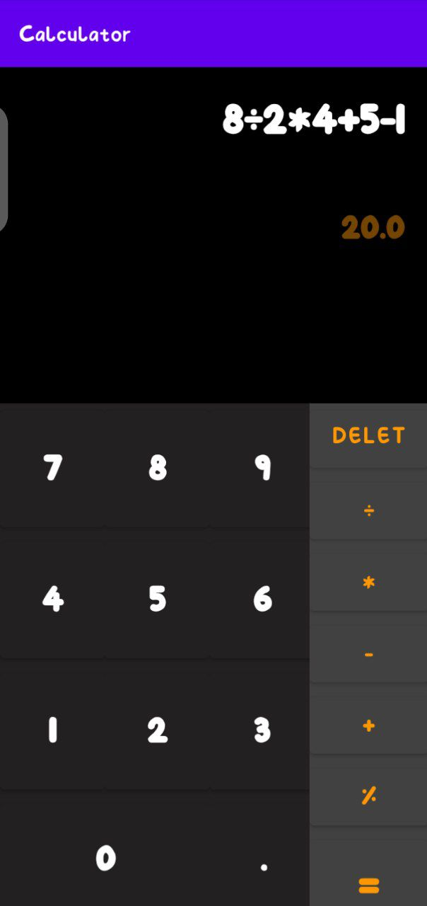

# Calculator App

This is a simple calculator app that allows you to perform basic arithmetic calculations. 

## Features
- [x] Addition (+)
- [x] Subtraction (-)
- [x] Multiplication (*)
- [x] Modulo(%)
- [x] Division (÷)

## Usage
1. Enter the first number using the numeric buttons.
2. Select the operation you want to perform using the corresponding button.
3. Enter the second number using the numeric buttons.
4. Press the equals (=) button to calculate the result.

## Example
Suppose you want to calculate the result of `5 + 8 - 3 * 2 / 4`. Here's how you can do it using this calculator app:

1. Press the `5` button.
2. Press the `+` button.
3. Press the `8` button.
4. Press the `-` button.
5. Press the `3` button.
6. Press the `*` button.
7. Press the `2` button.
8. Press the `/` button.
9. Press the `4` button.
10. Press the `=` button.

The result will be displayed on the screen as `5.0`.

## Screenshots

### UI :

### Calculation :

### Result :

## Technologies Used

This project was built using the following technologies:

- Java programming language: Java is the primary language used to develop the application.
- Android Studio: It is an Integrated Development Environment (IDE) used to develop the Android app.
- Android SDK: It provides the necessary libraries and APIs to develop Android apps.
- Git: It is used for version control and code management.
- Markdown: It is a lightweight markup language used to write documentation and README files.
- Gradle: It is a build system used to build and manage dependencies for the project.

## Contributing
If you are interested in contributing to this project, we welcome your contributions! Here are the steps you can follow:

Fork the repository to your own GitHub account.
Clone the repository to your local machine.
Make the changes you want to contribute.
Commit your changes and push them to your fork.
Open a pull request on the original repository and describe the changes you made.
Please note that all contributions are subject to review and may require some modifications before they are merged into the project. Also, please follow the code of conduct and guidelines for contributing that are outlined in the project's README file.

## Author 

- [:link:](https://github.com/Abdelilah-Falih) <ins>Abdelilah Falih.</ins>

